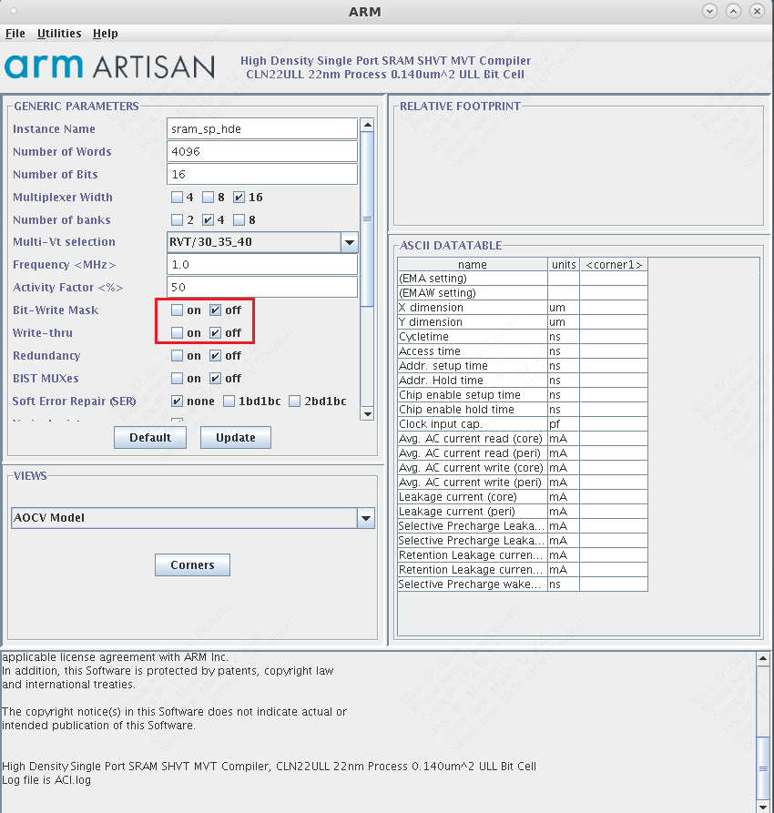
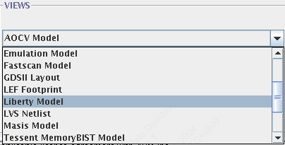
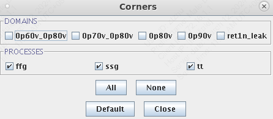
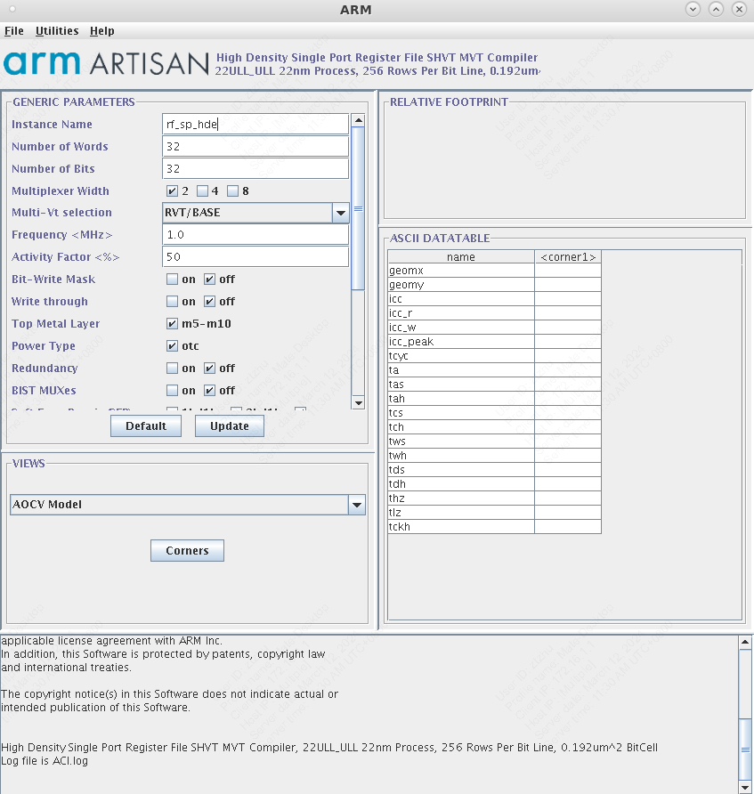

# Genus Workflow

* 此处介绍了Cadance Genus的数字综合流程，主要涉及到一些基本的脚本修改。

## SRAM/Register File替换

由于许多数字模块中依赖于较大规模的寄存器堆/SRAM高速缓存，这些模块需要替换成专门的IP核，而不是使用RTL代码直接综合，从而可以显著减小模块面积
主要用到的是ARM提供的`SRAM Compiler`和`Register File Compiler`
在`./scripts/sram/`文件夹下新建文件夹，并在该文件夹下启动`SRAM Compiler`/`Register File Compiler`，用于存放生成的文件。

### SRAM Compiler

常规使用的是ARM提供的`High Density Single Port SRAM SHVT MVT Compiler`


部分常见的设置选项如下：
* `Number of Words`: SRAM的深度
* `Number of Bits`: SRAM的宽度
* `Multiplexer Width`, `Number of Banks`会影响最终SRAM的形状，也受到数据深度与宽度的影响。在某些深度与宽度的组合下，可能无法找到一个合法的MUX与Bank数组合，在这种情况下可以考虑将SRAM的宽度减半，分开生成。
* `Frequency`保持与整体设计的时钟周期一致。
* `Bit Write Mask`允许你在写入数据时选择性地更新特定的位，而不用更新整个字（Word）。为此我们需要 生成单独的掩码（Mask）信号来控制在每次写入SRAM时想要对哪几位进行操作。

在我们自己的模块中使用SRAM Compiler生成的单元，需要生成相应的文件。
* 在`views`部分选择`LEF Footprint`, `LVS Netlist`, `Liberty Model`, `Verilog Model`


* 在`Corners`菜单中勾选所有的domain与processes，以保证生成综合报告的完整性。



### Register File Compiler

与`SRAM Compiler`流程类似。


## RTL数字综合

1. 修改工艺路径
  * `./scripts/design_input_macro.tcl` 中修改PDK和标准库的路径
    ```tcl
    set std_lib MY_STD_LIB
    ```
  * `std_lib`可选：
   * `tcbn22ullbwp30p140lvt`
   * `tcbn22ullbwp30p140hvt`
   * `tcbn22ullbwp7t30p140lvt`
   * `tcbn22ullbwp7t30p140hvt`
   * `tcbn22ullbwp7t40p140ehvt`
   * `tcbn22ullbwp7t40p140hvt`

2. 添加RTL
  * 添加RTL代码至`./rtl/`
  * 在`./rtl/srcs.tcl`中添加文件名
    ```tcl
    read_hdl ../rtl/MY_MODULE_1.v
    read_hdl ../rtl/MY_MODULE_2.v
    ```

3. 定义顶层模块
  * 在`./scripts/core_config.tcl`中定义需要综合的**顶层模块名称**
    ```tcl
    set rm_core_top MY_TOP_MODULE
    ```

4. 定义时钟周期
  * 在`./scripts/design_input_macro.tcl`中
    ```tcl
    set rm_clock_period MY_CLOCK_PERIOD
    ```
  * 单位为ns

5. 带有SRAM的数字综合
  * 将所需要的SRAM LIB文件生成并放置于`./sram/my_sram_lib_files/`文件夹中，
  * 在`./scripts/design_input_macro.tcl`中添加综合所需要的SRAM
    ```tcl
    set sram_insts [concat $MACROname_rams \
        "my_sram_lib_files" \
    ]
    ```

6. 启动综合
  * `b make genus_syn`

7. 检查生成文件
  * `./data/MY_TOP_MODULE-genus.v`：生成的gate level netlist
  * `./data/func-genus.sdc`：生成的SDC
  * `./logs/genus_synthesis.log`：生成的log文件
  * `./reports/genus/func_tt_0p90v_025c_timing.rpt`：tt corner的timing report

## Gate-level的数字仿真

* 进行带有SDF的仿真，确保生成的gate level netlist逻辑正确
* **需要在testbench中将SDF文件annotate**
  ```verilog
  initial begin
  $sdf_annotate("../models/sdf/adder_8bit.sdf", ADDER,,, "MAXIMUM", "1.6:1.4:1.2", "FROM_MTM");
  ```
* `b make compile_gate`
* `b make verdi` 打开波形图
