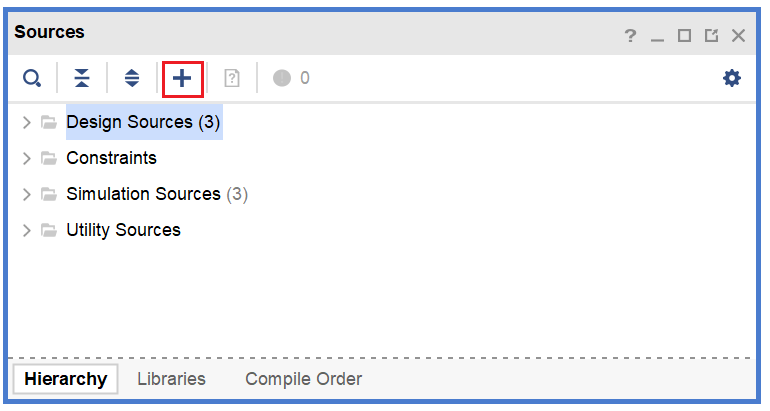
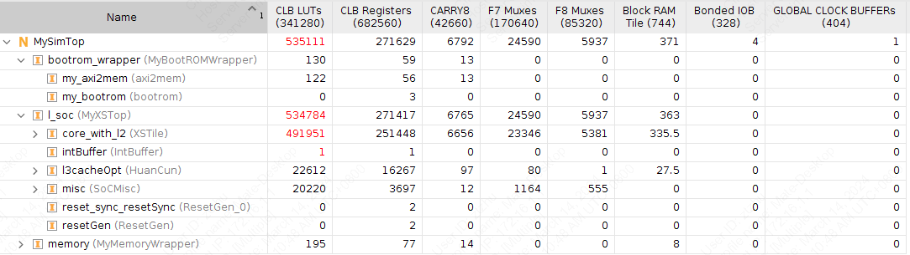

# FPGA验证

使用Xilinx Vivado 2019.1进行FPGA验证。

## FPGA流程简介

在完成RTL代码设计之后，可以进入FPGA验证流程，大致分为以下几个阶段：

### 导入设计

打开Vivado，选择`Create Project`，选择合适的工程名字和路径。如果是在本地运行，尽量避免中文路径，否则Vivado后续可能报错。

选择`RTL Project`，连续选择`Next`，在`Default Part`选择验证所使用的FPGA核心板型号

完成工程创建向导之后即可进入Vivado主界面。在`PROJECT MANAGER` -> `Sources`添加RTL代码


在弹出界面中选择`Add or create design sources` -> `Add Files`即可导入设计。

### 编写仿真程序

为了验证RTL代码是否正确，需要用Verilog或SystemVerilog编写一个Testbench，通过观察波形验证设计是否符合需求。

一个简单的Testbench大致如下。
```verilog
module tb_top();

reg clock;
reg reset;

initial begin
    clock = 0;
    reset = 1
    #100 reset = 0;
    #2000000 $finish;
end
always begin
    #1 clock <= ~clock;
end 

MySimTop dut(
    .clock(clock),
    .reset(reset)
);

endmodule
```

### Behavioral Simulation 行为仿真

对RTL代码编译之后即可进行的仿真，用于验证逻辑功能的正确性。
在逻辑综合前需要进行功能仿真，以便尽早发现设计中的缺陷。

### Synthesis 逻辑综合

在进行逻辑综合之前，需要预先选定目标的FPGA平台。综合工具会根据FPGA核心所包含的LUT、BRAM等资源对硬件设计进行逻辑综合。

在完成逻辑综合之后，会给出门级网表的各类信息，包括硬件设计所使用的FPGA资源。

如下图所示，该设计所需要的硬件资源超过了FPGA核心的限制，无法在单个FPGA芯片中实现。


### 替换Block RAM

在出现LUT的资源占用过多的情况下，可以考虑将硬件设计中大块的缓存和存储单元用Vivado工具提供的Block RAM IP核替换，可以避免用LUT直接综合，从而减少LUT的利用率。

### Implementation Place & Route实现

在逻辑综合之后，需要基于门级网表进行布局布线，得到硬件设计在FPGA芯片上的物理实现。

布局布线完成之后，FPGA资源利用率会有所变化，这是因为在布局布线的过程中会改变逻辑单元的位置，导致LUT等资源的使用产生变化。

### Generate Bitstream

在布局布线完成之后，需要生成比特流，连接FPGA板，并把相应的代码录入到FPGA核心之中，实现硬件逻辑的重构。